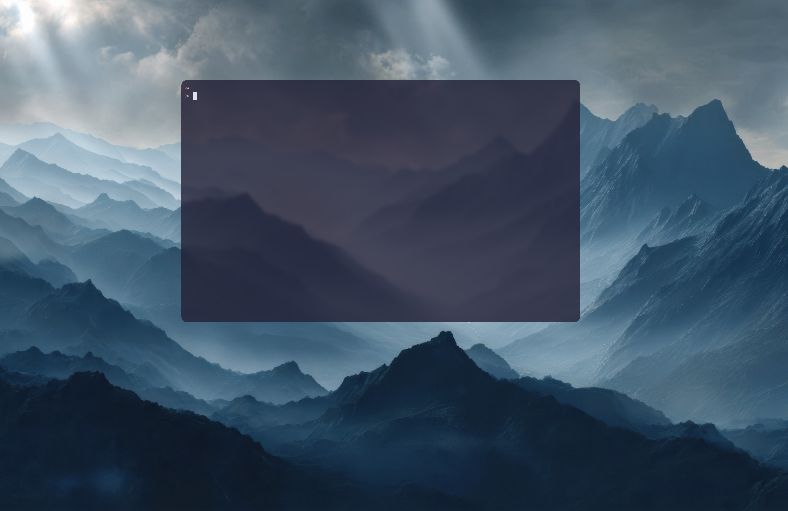

*This blog post outlines how to use the declarative package manager Nix to set up a new macOS system using Nix-Darwin. Nix comes with its own functional programming language that lets you write scripts for setting up your systems from scratch, including software installation and settings.*

I finally swallowed my pride and bought myself a MacBook. I had been holding off for so long, ever since I got my first iPhone back in 2007 and got so upset about being forced to use Apple software and unable to surf Flash websites that I decided I'd stick with Android and Windows for the rest of my life. That was 19 years ago - 19-year-old me made that call - so I figured an equivalent lifetime had passed and I was now free to get whatever I wanted.

And my god does it feel good to work on a system built around the Linux kernel, with high-end UX design, and access to the vibrant ecosystem around macOS and zsh. The first thing I did was spend time setting up my system using [nix-darwin][nix-darwin], which brings the Nix package manager to macOS. Nix ships with its own functional programming language, letting you write declarative scripts for package and system management. Following this approach, and some helpful guides (links at the end), I ended up with a minimalistic setup I'm quite happy with:

This also includes installing and managing the relevant software, dependencies, and settings I need for my work as a life-science researcher spanning both the wet lab and computational biology. Here are three reasons I think this is a great way to manage your workstation:

1. **Reproducibility**. Declarative scripts can be reproduced, shared, and iteratively improved on, all while providing searchable documentation of the system setup.
2. **Exploration**. Try new tools with easy rollback by checking your system config into version control - something that matters even more with generative AI in the mix.
3. **Aesthetics**. Make your system feel and look the way you want it to.

### Want to give it a go?
Here are some links to get you started:

* [hugoakerstrand/dotfiles][my-dotfiles-repo] - my GitHub repo. NB! I don't recommend copying and pasting mine or anyone else's setup - make your system fit you!
* [Video instructions][video-instructions] - Kun Chen does a great job of getting you started with nix-darwin in this YouTube video.

[nix-darwin]: https://github.com/nix-darwin/nix-darwin/ "github/nix-darwin"
[my-dotfiles-repo]: https://github.com/hugoakerstrand/dotfiles/
[video-instructions]: https://youtu.be/5N-okeDdIuI?si=_FG13Pw33U8PK5rT
